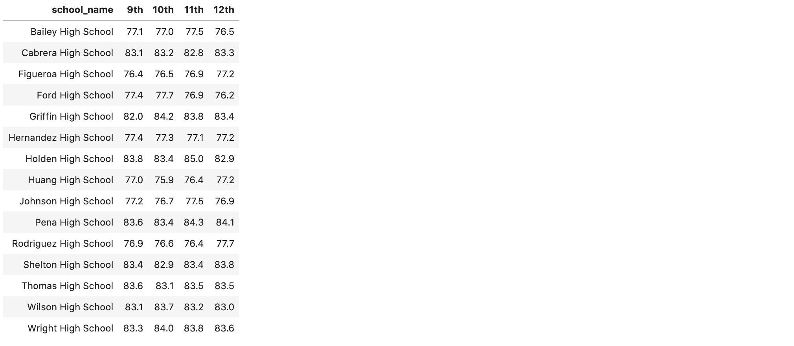
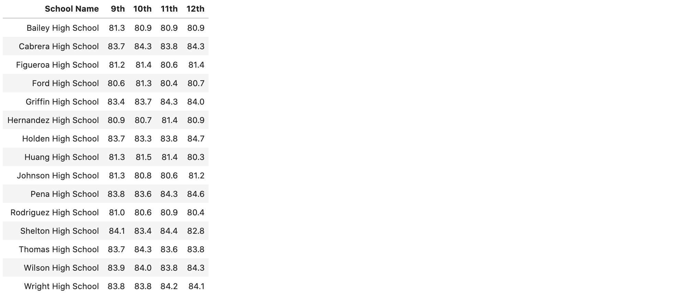
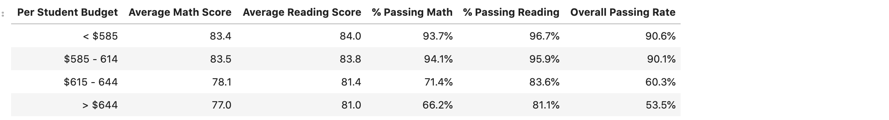
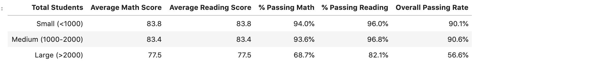
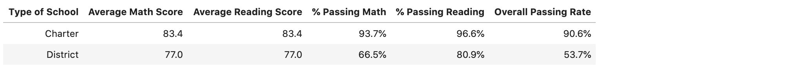

# pandas-challenge
###### by Libardo Lambrano

## Overview <a name="top"></a>

Using python scripting language to analyze students' district-wide standardized test results.

* [Summary Assignment](#pycityschools)
* [Solution](#solution)
* [Link to Jupyter Notebook](PyCitySchools/standarized-test-results.ipynb)

---

## PyCitySchools 

---
> **Given**

Access to every student's math and reading scores `schools_complete.csv`, as well as various information on the schools they attend `schools_complete.csv`. 

---
> **Tasks**

**District Summary**

Create a high level snapshot (in table form) of the district's key metrics, including:

* Total Schools
* Total Students
* Total Budget
* Average Math Score
* Average Reading Score
* % Passing Math (The percentage of students that passed math.)
* % Passing Reading (The percentage of students that passed reading.)
* % Overall Passing (The percentage of students that passed math and reading.)

[view solution](#summary_district)

---
**School Summary**

Create an overview table that summarizes key metrics about each school, including:

* School Name
* School Type
* Total Students
* Total School Budget
* Per Student Budget
* Average Math Score
* Average Reading Score
* % Passing Math (The percentage of students that passed math.)
* % Passing Reading (The percentage of students that passed reading.)
* % Overall Passing (The percentage of students that passed math and reading.)

[view solution](#school_summary)

---
**Top Performing Schools (By % Overall Passing)**

Create a table that highlights the top 5 performing schools based on % Overall Passing. Include:
* School Name
* School Type
* Total Students
* Total School Budget
* Per Student Budget
* Average Math Score
* Average Reading Score
* % Passing Math (The percentage of students that passed math.)
* % Passing Reading (The percentage of students that passed reading.)
* % Overall Passing (The percentage of students that passed math and reading.)

[view solution](#top_schools)

---
**Bottom Performing Schools (By % Overall Passing)**

Create a table that highlights the bottom 5 performing schools based on % Overall Passing. Include all of the same metrics as above.

[view solution](#bottom_schools)

---
**Math Scores by Grade** 

Create a table that lists the average Math Score for students of each grade level (9th, 10th, 11th, 12th) at each school.

[view solution](#math_scores_by_grade)

---
**Reading Scores by Grade**

Create a table that lists the average Reading Score for students of each grade level (9th, 10th, 11th, 12th) at each school.

[view solution](#reading_scores_by_grade)

---
**Scores by School Spending**

Create a table that breaks down school performances based on average Spending Ranges (Per Student). Use 4 reasonable bins to group school spending. Include in the table each of the following:

* Average Math Score
* Average Reading Score
* % Passing Math (The percentage of students that passed math.)
* % Passing Reading (The percentage of students that passed reading.)
* % Overall Passing (The percentage of students that passed math and reading.)

[view solution](#scores_by_school_spending)

---
**Scores by School Size**

Repeat the above breakdown, but this time group schools based on a reasonable approximation of school size (Small, Medium, Large).

[view solution](#scores_by_school_size)

---
**Scores by School Type**

Repeat the above breakdown, but this time group schools based on school type (Charter vs. District).

[view solution](#scores_by_school_type)

---
**Observable Trends**

* Include a written description of at least two observable trends based on the data.

[Back to the top](#top)

[view comments](#comments)

---
> ### Solution 
---
<a name="summary_district"></a>
**District Summary** 


<details><summary>click here to view steps</summary>

1. Import modules, read source files

    ```
    schools_data_path = "../Resources/schools_complete.csv"
    students_data_path = "../Resources/students_complete.csv"
    schools_df = pd.read_csv(schools_data_path)
    students_df = pd.read_csv(students_data_path)
    ```

2. Combine datasets

    ```
    school_students_df = pd.merge(students_df, schools_df, how='left', on=['school_name', 'school_name'])
    school_students_df
    ```


3. Calculate totals, averages, and % passing scores

    ```
    # Finding total schools 
    schools_count = len(school_students_df['school_name'].unique())

    # finding total students
    students_count = len(school_students_df['student_name'])

    # finding total budget
    total_budget = sum(school_students_df['budget'].unique())

    # finding average math score
    ave_math_score = (school_students_df['math_score'].mean())

    # finding average reading score
    ave_reading_score = (school_students_df['reading_score'].mean())

    # finding % passing math
    num_passing_math = school_students_df.loc[school_students_df['math_score'] >=70]['math_score'].count()
    per_passing_math = num_passing_math/students_count
    per_passing_math

    # finding % passing reading 
    num_passing_reading = school_students_df.loc[school_students_df['reading_score'] >=70]['reading_score'].count()
    per_passing_reading = num_passing_reading/students_count

    # finding overal passing 
    overall_passing = school_students_df[(school_students_df['reading_score'] >= 70) & (school_students_df['math_score'] >= 70)]['student_name'].count()/students_count
    ```
4. Assign values to dataframe and apply format to the numbers

    ```
    summary_df = pd.DataFrame({
                            'Total Schools': [schools_count],
                            'Total Students': [students_count],
                            'Total Budget': [total_budget],
                            'Average Math Score': [ave_math_score],
                            'Average Reading Score': [ave_reading_score],
                            '% Passing Math': [per_passing_math],
                            '% Passing Reading': [per_passing_reading],
                            'Overall Passing': [overall_passing]
                            })

    summary_df.style.format({'Total Schools':'{:,}', 
                            'Total Students':'{:,}',
                            'Total Budget':'${:,}', 
                            'Average Math Score':'{:.1f}', 
                            'Average Reading Score':'{:.1f}', 
                            '% Passing Math':'{:.1%}', 
                            '% Passing Reading':'{:.1%}', 
                            'Overall Passing':'{:.1%}'})

    summary_df
    ```

[Back to District Summary solution](#summary_district)
</details>

[Back to the top](#top)

---
<a name="school_summary"></a>
**School Summary**


<details><summary>click here to view steps</summary>

1. Group data by school
    
    ```
    sc_school = school_students_df.set_index('school_name').groupby(['school_name'])
    ```

2. Calculate totals, averages, and % passing scores

    ```
    # school Name
    sc_school = school_students_df.set_index('school_name').groupby(['school_name'])

    # school type
    sc_type = schools_df.set_index('school_name')['type']

    # Total Students
    sc_students = sc_school['Student ID'].count()

    # Total School Budget
    sc_budget = schools_df.set_index('school_name')['budget']

    # Per Student Budget
    st_budget = schools_df.set_index('school_name')['budget']/schools_df.set_index('school_name')['size']

    # Average Math Score
    avg_math = sc_school['math_score'].mean()

    # Average Reading Score
    avg_read = sc_school['reading_score'].mean()

    # % Passing Math
    pass_math = school_students_df[school_students_df['math_score'] >= 70].groupby('school_name')['Student ID'].count()/sc_students 

    # % Passing Reading
    pass_read = school_students_df[school_students_df['reading_score'] >= 70].groupby('school_name')['Student ID'].count()/sc_students

    # % Overall Passing (The percentage of students that passed math and reading.)
    overall = school_students_df[(school_students_df['reading_score'] >= 70) & (school_students_df['math_score'] >= 70)].groupby('school_name')['Student ID'].count()/sc_students

3. Assign values to dataframe

    ```
    summary_sc = pd.DataFrame({
        'School Type': sc_type, 
        'Total Students' : sc_students,
        'Total School Budget': sc_budget,
        'Per Student Budget' : st_budget,
        'Average Math Score': avg_math,
        'Average Reading Score' : avg_read,
        '% Passing Math': pass_math,
        '% Passing Reading': pass_read,
        'Overall Passing Rate': overall
    })
    ```

4. Format numbers 

    ```
    summary_sc.style.format({'Total Students': '{:,}',
                           'Total School Budget': '${:,}', 
                           'Per Student Budget': '${:.0f}', 
                           'Average Math Score': '{:.1f}', 
                           'Average Reading Score': '{:.1f}', 
                           'Total School Budget': '${:,}', 
                           '% Passing Math': '{:.1%}', 
                           '% Passing Reading': '{:.1%}', 
                           'Overall Passing Rate': '{:.1%}'})

    summary_sc
    ```

[Back to School Summary solution](#school_summary)
</details>

[Back to the top](#top)

---
<a name="top_schools"></a>
**Top Performing Schools (By % Overall Passing)**


<details><summary>click here to view steps</summary>

1. Get top schools by `overall passing rate`
    
    ```
    top_5 = summary_sc.sort_values('Overall Passing Rate', ascending = False)
    ```

2. Format dataframe numbers 
    ```
    top_5.head(5).style.format({'Total Students': '{:,}',
                           'Total School Budget': '${:,}', 
                           'Per Student Budget': '${:.0f}', 
                           'Average Math Score': '{:.1f}', 
                           'Average Reading Score': '{:.1f}', 
                           'Total School Budget': '${:,}', 
                           '% Passing Math': '{:.1%}', 
                           '% Passing Reading': '{:.1%}', 
                           'Overall Passing Rate': '{:.1%}'})
    ```
 
[Back to 'Top Performing Schools' solution)](#top_schools)
</details>

[Back to the top](#top)

---
<a name="bottom_schools"></a>
**Bottom Performing Schools (By % Overall Passing)**


<details><summary>click here to view steps</summary>

1. Get bottom schools by `overall passing rate`

    ```
    bottom_5 = summary_sc.sort_values('Overall Passing Rate', ascending = True)
    ```

2. Format dataframe numbers 

    ```bottom_5.head(5).style.format({'Total Students': '{:,}',
                           'Total School Budget': '${:,}', 
                           'Per Student Budget': '${:.0f}', 
                           'Average Math Score': '{:.1f}', 
                           'Average Reading Score': '{:.1f}', 
                           'Total School Budget': '${:,}', 
                           '% Passing Math': '{:.1%}', 
                           '% Passing Reading': '{:.1%}', 
                           'Overall Passing Rate': '{:.1%}'})
    ```

[Back to 'Bottom Performing Schools' solution](#bottom_schools)
</details>

[Back to the top](#top)

---
<a name="math_scores_by_grade"></a>
**Math Scores by Grade**



<details><summary>click here to view steps</summary>

1. Calculate average of math scores by grade 

    ```
    ninth_math = students_df.loc[students_df['grade'] == '9th'].groupby('school_name')['math_score'].mean()
    tenth_math = students_df.loc[students_df['grade'] == '10th'].groupby('school_name')['math_score'].mean()
    eleventh_math = students_df.loc[students_df['grade'] == '11th'].groupby('school_name')['math_score'].mean()
    twelfth_math = students_df.loc[students_df['grade'] == '12th'].groupby('school_name')['math_score'].mean()

    math_scores = pd.DataFrame({
            '9th': ninth_math,
            '10th': tenth_math,
            '11th': eleventh_math,
            '12th': twelfth_math
    })
    ```

2. Assign values to dataframe and set index to `school name`
    ```
    math_scores = math_scores[['9th', '10th', '11th', '12th']]
    math_scores.index.name = "school_name"
    ```

3. Format numbers and align headers
    ```
    math_scores.style.format({'9th': '{:.1f}', 
                          "10th": '{:.1f}', 
                          "11th": "{:.1f}", 
                          "12th": "{:.1f}"})
    ```
 
[Back to 'Math Scores by Grade' solution](#math_scores_by_grade)
</details>

[Back to the top](#top)

---
<a name="reading_scores_by_grade"></a>
**Reading Scores by Grade**



<details><summary>click here to view steps</summary>

1. Calculate average of reading scores by grade
    ```
    ninth_reading = students_df.loc[students_df['grade'] == '9th'].groupby('school_name')["reading_score"].mean()
    tenth_reading = students_df.loc[students_df['grade'] == '10th'].groupby('school_name')["reading_score"].mean()
    eleventh_reading = students_df.loc[students_df['grade'] == '11th'].groupby('school_name')["reading_score"].mean()
    twelfth_reading = students_df.loc[students_df['grade'] == '12th'].groupby('school_name')["reading_score"].mean()

2. Assign values to dataframe and set index to `school name`
    ```
        reading_scores = pd.DataFrame({
        "9th": ninth_reading,
        "10th": tenth_reading,
        "11th": eleventh_reading,
        "12th": twelfth_reading
    })

    reading_scores = reading_scores[['9th', '10th', '11th', '12th']]
    reading_scores.index.name = "School Name"
    reading_scores.reset_index(inplace=True)

3. Format numbers and align headers
    ```
    reading_scores.style.format({
        '9th': '{:.1f}', 
        "10th": '{:.1f}', 
        "11th": "{:.1f}", 
        "12th": "{:.1f}",
        'School Names': 'School Names'}).hide_index()
    ```
[Back to 'Reading Scores by Grade' solution](#reading_scores_by_grade)

</details>

[Back to the top](#top)

---
<a name="scores_by_school_spending"></a>
**Scores by School Spending**



<details><summary>click here to view steps</summary>

1. Create bins

    ```
    bins = [0, 584.999, 614.999, 644.999, 999999]
    group_name = ['< $585', '$585 - 614', '$615 - 644', '> $644']
    school_students_df['spending_bins'] = pd.cut(school_students_df['budget']/school_students_df['size'], bins, labels = group_name)
    by_spending = school_students_df.groupby('spending_bins')
    ```
2. Calculate average scores and group by `spending_bins`

    ```
    avg_math = by_spending['math_score'].mean()
    avg_read = by_spending['reading_score'].mean()
    pass_math = school_students_df[school_students_df['math_score'] >= 70].groupby('spending_bins')['Student ID'].count()/by_spending['Student ID'].count()
    pass_read = school_students_df[school_students_df['reading_score'] >= 70].groupby('spending_bins')['Student ID'].count()/by_spending['Student ID'].count()
    overall = school_students_df[(school_students_df['reading_score'] >= 70) & (school_students_df['math_score'] >= 70)].groupby('spending_bins')['Student ID'].count()/by_spending['Student ID'].count()
    ```

3. Assign values to datafrane
    ```
    # assignment of values to df
    scores_by_spend = pd.DataFrame({
        "Average Math Score": avg_math,
        "Average Reading Score": avg_read,
        '% Passing Math': pass_math,
        '% Passing Reading': pass_read,
        "Overall Passing Rate": overall          
    })

4. Set `Per Student Budget` of school as `index`
    ```
    scores_by_spend.index.name = "Per Student Budget"
    scores_by_spend.reset_index(inplace=True)   

5. Format numbers and align headers
    ```
    scores_by_spend.style.format({
        'Average Math Score': '{:.1f}', 
        'Average Reading Score': '{:.1f}', 
        '% Passing Math': '{:.1%}', 
        '% Passing Reading':'{:.1%}', 
        'Overall Passing Rate': '{:.1%}'}).hide_index() 
 
[Back to 'Scores by School Spending' solution](#scores_by_school_spending)
</details>

[Back to the top](#top)

---
<a name="scores_by_school_size"></a>
**Scores by School Size**



<details><summary>click here to view steps</summary>

1. Create bins

    ```
    bins = [0, 999, 1999, 100000]
    bin_name = ['Small (<1000)', 'Medium (1000-2000)', 'Large (>2000)']
    school_students_df ['size_bins'] = pd.cut(school_students_df['size'], bins, labels = bin_name)
    by_size = school_students_df.groupby('size_bins')

2. Calculate average scores and group by `size_bins`
    ```
    avg_math = by_size['math_score'].mean()
    avg_read = by_size['math_score'].mean()
    pass_math = school_students_df[school_students_df['math_score'] >= 70].groupby('size_bins')['Student ID'].count()/by_size['Student ID'].count()
    pass_read = school_students_df[school_students_df['reading_score'] >= 70].groupby('size_bins')['Student ID'].count()/by_size['Student ID'].count()
    overall = school_students_df[(school_students_df['reading_score'] >= 70) & (school_students_df['math_score'] >= 70)].groupby('size_bins')['Student ID'].count()/by_size['Student ID'].count()

3. Assign values to datafrane
    ```
    scores_by_sc_size = pd.DataFrame({
        'Average Math Score': avg_math,
        'Average Reading Score': avg_read,
        '% Passing Math': pass_math,
        '% Passing Reading': pass_read,
        'Overall Passing Rate': overall         
    })

4. Set `Total Students` of school as `index`
    ```
    scores_by_sc_size.index.name = 'Total Students'
    scores_by_sc_size.reset_index(inplace=True)
    ```

5. Format numbers and align headers
    ```
    scores_by_sc_size.style.format({
        'Average Math Score': '{:.1f}', 
        'Average Reading Score': '{:.1f}', 
        '% Passing Math': '{:.1%}', 
        '% Passing Reading':'{:.1%}', 
        'Overall Passing Rate': '{:.1%}'}).hide_index()
 
[Back to 'Scores by School Size' solution](#scores_by_school_size)
</details>

[Back to the top](#top)

---
<a name="scores_by_school_type"></a>
**Scores by School type**



<details><summary>click here to view steps</summary>

1. Group schools by `type`

    ```
    by_type = school_students_df.groupby("type")
    ```

2. Calculate average scores and group by `type`
    ```
    avg_math = by_type['math_score'].mean()
    avg_read = by_type['math_score'].mean()
    pass_math = school_students_df[school_students_df['math_score'] >= 70].groupby('type')['Student ID'].count()/by_type['Student ID'].count()
    pass_read = school_students_df[school_students_df['reading_score'] >= 70].groupby('type')['Student ID'].count()/by_type['Student ID'].count()
    overall = school_students_df[(school_students_df['reading_score'] >= 70) & (school_students_df['math_score'] >= 70)].groupby('type')['Student ID'].count()/by_type['Student ID'].count()
    ```

3. Assign values to datafrane
    ```
    scores_by_sc_type = pd.DataFrame({
        "Average Math Score": avg_math,
        "Average Reading Score": avg_read,
        '% Passing Math': pass_math,
        '% Passing Reading': pass_read,
        "Overall Passing Rate": overall})
    ```

4. Set `type of school` of school as `index`
    ```
    scores_by_sc_type.index.name = "Type of School"
    scores_by_sc_type.reset_index
    ```

5. Format numbers and align headers
    ```
    scores_by_sc_type.style.format({
        'Average Math Score': '{:.1f}', 
        'Average Reading Score': '{:.1f}', 
        '% Passing Math': '{:.1%}', 
        '% Passing Reading':'{:.1%}', 
        'Overall Passing Rate': '{:.1%}'}).hide_index()
    ```
 
[Back to 'Scores by School type' solution](#scores_by_school_type)
</details>

[Back to the top](#top)

---
<a name="comments"></a>
**Comments**

<details><summary>click here to view comments</summary>

1. Students perform better in charter schools than district schools

    Based on this data analysis, it seems charter school education is better than district school education. In charter schools students performed a lot better in math and reading. Both of these metrics are above 80 for charter schools, buf only on the high seventies for district schools. 

    

2. Schools with lower budgets do better than richer schools

    This is conterintuitive, but it seems that schools with larger budgets have lower students' scores overall. The overall passing score for schools with less than $580 of budget per student was 90.6%, compared with only 53% overall passing score in those schools with budgets above $644 per student. 

    
 
[Back to Comments](#comments)
</details>

[Back to the top](#top)