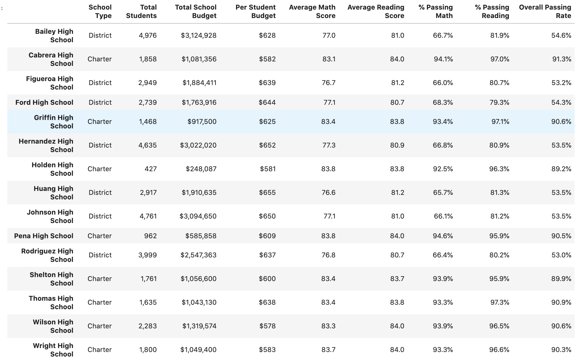

# pandas-challenge
###### by Libardo Lambrano

## Overview <a name="top"></a>

Using python scripting language to analyze students' district-wide standardized test results.

* [Summary Assignment](#pycityschools)
* [Solution](#solution)
* [Link to Jupyter Notebook](PyCitySchools/standarized-test-results.ipynb)

---

## PyCitySchools 

---
> **Given**

Access to every student's math and reading scores `schools_complete.csv`, as well as various information on the schools they attend `schools_complete.csv`. 

---
> **Tasks**

**District Summary**

Create a high level snapshot (in table form) of the district's key metrics, including:

* Total Schools
* Total Students
* Total Budget
* Average Math Score
* Average Reading Score
* % Passing Math (The percentage of students that passed math.)
* % Passing Reading (The percentage of students that passed reading.)
* % Overall Passing (The percentage of students that passed math and reading.)

[view solution](#summary_district)

---
**School Summary**

Create an overview table that summarizes key metrics about each school, including:

* School Name
* School Type
* Total Students
* Total School Budget
* Per Student Budget
* Average Math Score
* Average Reading Score
* % Passing Math (The percentage of students that passed math.)
* % Passing Reading (The percentage of students that passed reading.)
* % Overall Passing (The percentage of students that passed math and reading.)

---
**Top Performing Schools (By % Overall Passing)**

Create a table that highlights the top 5 performing schools based on % Overall Passing. Include:
* School Name
* School Type
* Total Students
* Total School Budget
* Per Student Budget
* Average Math Score
* Average Reading Score
* % Passing Math (The percentage of students that passed math.)
* % Passing Reading (The percentage of students that passed reading.)
* % Overall Passing (The percentage of students that passed math and reading.)

---
**Bottom Performing Schools (By % Overall Passing)**

Create a table that highlights the bottom 5 performing schools based on % Overall Passing. Include all of the same metrics as above.

---
**Math Scores by Grade** 

Create a table that lists the average Math Score for students of each grade level (9th, 10th, 11th, 12th) at each school.

---
**Reading Scores by Grade**

Create a table that lists the average Reading Score for students of each grade level (9th, 10th, 11th, 12th) at each school.

---
**Scores by School Spending**

Create a table that breaks down school performances based on average Spending Ranges (Per Student). Use 4 reasonable bins to group school spending. Include in the table each of the following:

* Average Math Score
* Average Reading Score
* % Passing Math (The percentage of students that passed math.)
* % Passing Reading (The percentage of students that passed reading.)
* % Overall Passing (The percentage of students that passed math and reading.)

---
**Scores by School Size**

Repeat the above breakdown, but this time group schools based on a reasonable approximation of school size (Small, Medium, Large).

---
**Scores by School Type**

Repeat the above breakdown, but this time group schools based on school type (Charter vs. District).

---
**Observable Trends**

* Include a written description of at least two observable trends based on the data.

[Back to the top](#top)

---
> ### Solution 
---
<a name="summary_district"></a>
**District Summary** 


<details><summary>click arrow down to view steps</summary>

1. Import modules, read source files

    ```
    schools_data_path = "../Resources/schools_complete.csv"
    students_data_path = "../Resources/students_complete.csv"
    schools_df = pd.read_csv(schools_data_path)
    students_df = pd.read_csv(students_data_path)
    ```

2. Combine datasets

    ```
    school_students_df = pd.merge(students_df, schools_df, how='left', on=['school_name', 'school_name'])
    school_students_df
    ```


3. Calculate totals, averages, and % passing scores

    ```
    # Finding total schools 
    schools_count = len(school_students_df['school_name'].unique())

    # finding total students
    students_count = len(school_students_df['student_name'])

    # finding total budget
    total_budget = sum(school_students_df['budget'].unique())

    # finding average math score
    ave_math_score = (school_students_df['math_score'].mean())

    # finding average reading score
    ave_reading_score = (school_students_df['reading_score'].mean())

    # finding % passing math
    num_passing_math = school_students_df.loc[school_students_df['math_score'] >=70]['math_score'].count()
    per_passing_math = num_passing_math/students_count
    per_passing_math

    # finding % passing reading 
    num_passing_reading = school_students_df.loc[school_students_df['reading_score'] >=70]['reading_score'].count()
    per_passing_reading = num_passing_reading/students_count

    # finding overal passing 
    overall_passing = school_students_df[(school_students_df['reading_score'] >= 70) & (school_students_df['math_score'] >= 70)]['student_name'].count()/students_count
    ```
4. Assign values to dataframe and apply format to the numbers

    ```
    summary_df = pd.DataFrame({
                            'Total Schools': [schools_count],
                            'Total Students': [students_count],
                            'Total Budget': [total_budget],
                            'Average Math Score': [ave_math_score],
                            'Average Reading Score': [ave_reading_score],
                            '% Passing Math': [per_passing_math],
                            '% Passing Reading': [per_passing_reading],
                            'Overall Passing': [overall_passing]
                            })

    summary_df.style.format({'Total Schools':'{:,}', 
                            'Total Students':'{:,}',
                            'Total Budget':'${:,}', 
                            'Average Math Score':'{:.1f}', 
                            'Average Reading Score':'{:.1f}', 
                            '% Passing Math':'{:.1%}', 
                            '% Passing Reading':'{:.1%}', 
                            'Overall Passing':'{:.1%}'})

    summary_df
    ```

</details>

[Back to solution](#summary_district)

---
**School Summary**

<ins>Final Output</ins>



[Back to the top](#top)
